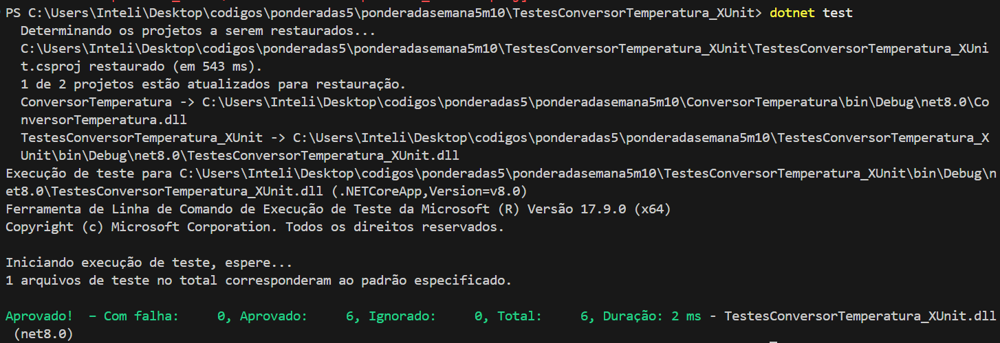

# Documentação de Testes Automatizados para Validação de Funcionalidades

Esta documentação detalha a atividade de validação da aplicação de cálculo de juros compostos e conversão de temperaturas. Foram implementados testes automatizados de unidade, mock e integração para garantir que as funcionalidades essenciais funcionem conforme o esperado, cobrindo cenários variados de uso e interações entre componentes.

## Configuração do Ambiente

Para executar e validar os testes, foram utilizadas as seguintes ferramentas e bibliotecas:

- **.NET Core SDK** para desenvolvimento da aplicação.
- Ferramentas de teste **NUnit**, **xUnit** e **MSTest** para validação de unidade.
- **NSubstitute** e **Moq** para criação de mocks que simulam dependências do sistema.
- **SpecFlow** para testes de integração baseados em BDD.
- Ferramentas de CI/CD, como **GitHub Actions**, para execução automática dos testes a cada atualização no repositório.

---

## Testes Implementados

Os testes foram divididos em três categorias principais. Abaixo, detalhamos cada categoria, seu propósito e o contexto dos cenários utilizados, além de capturas de tela da execução de cada teste.

### 1. Testes Unitários

#### Descrição

Os testes unitários foram aplicados para verificar a exatidão da conversão de temperaturas, garantindo que a função de conversão entre Fahrenheit e Celsius produza resultados corretos em diferentes entradas. Cada teste valida um cenário específico de conversão para cobrir a variedade de dados possíveis.

#### Contexto dos Testes

O contexto desses testes é validar de forma isolada a precisão dos cálculos de conversão de temperatura, sem dependências externas. A aplicação utiliza três frameworks de teste diferentes (NUnit, xUnit e MSTest), que realizam verificações independentes para assegurar a consistência e confiabilidade do código de conversão.

#### Execução dos Testes Unitários

- **Execução com NUnit:**

   

- **Execução com xUnit:**

   

- **Execução com MSTest:**

   

---

### 2. Testes de Mock

#### Descrição

Os testes de mock têm como objetivo simular interações com dependências da aplicação, como serviços de log, sem precisar de implementações reais dessas dependências. Isso permite focar na lógica interna de como a aplicação interage com esses serviços.

#### Contexto dos Testes

Esses testes foram configurados para garantir que, ao realizar uma operação de cálculo, o sistema corretamente interage com um serviço de log. Essa abordagem permite validar a chamada do log e a mensagem enviada durante o processo, utilizando dois frameworks de mock: NSubstitute e Moq.

#### Execução dos Testes de Mock

- **Execução com NSubstitute:**

   

- **Execução com Moq:**

   

---

### 3. Testes de Integração

#### Descrição
   Os testes de integração foram planejados para validar o funcionamento integrado das principais funcionalidades da aplicação, simulando operações que o usuário final executaria. A abordagem do SpecFlow com BDD (Behavior-Driven Development) foi escolhida para permitir um mapeamento claro das interações e dos requisitos esperados. Com essa abordagem, cada funcionalidade é descrita com base em user stories, ajudando a conectar os casos de teste ao comportamento esperado em cenários do mundo real.

#### Contexto dos Testes
   Os testes de integração focam em garantir que o sistema responda adequadamente a operações completas de cálculo de juros compostos, desde a entrada dos valores iniciais (como montante, taxa de juros e prazo) até a obtenção do valor final calculado. Em um cenário de testes integrado, esse processo é verificado para que o sistema funcione como um todo, simulando a experiência do usuário e identificando eventuais inconsistências entre diferentes componentes. Esse tipo de teste ajuda a assegurar que o fluxo completo de cálculo, que depende de várias partes da aplicação, está funcionando de forma correta.

---

